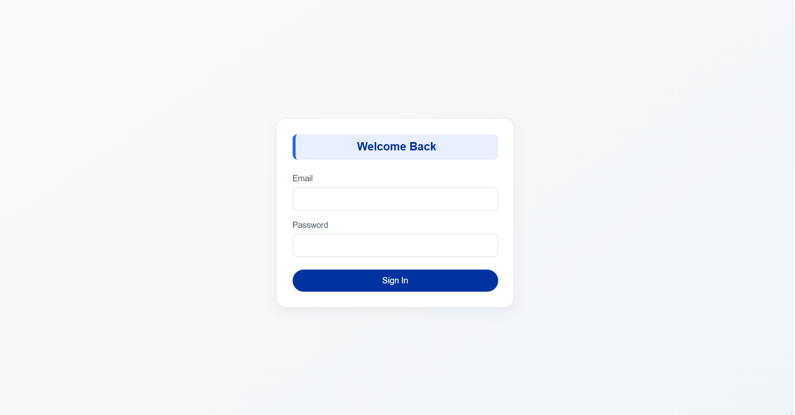
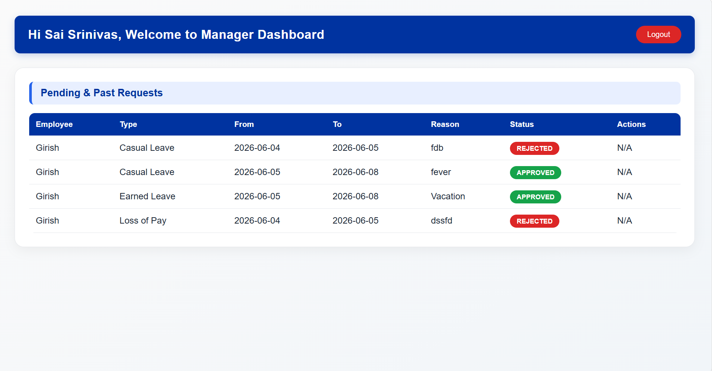
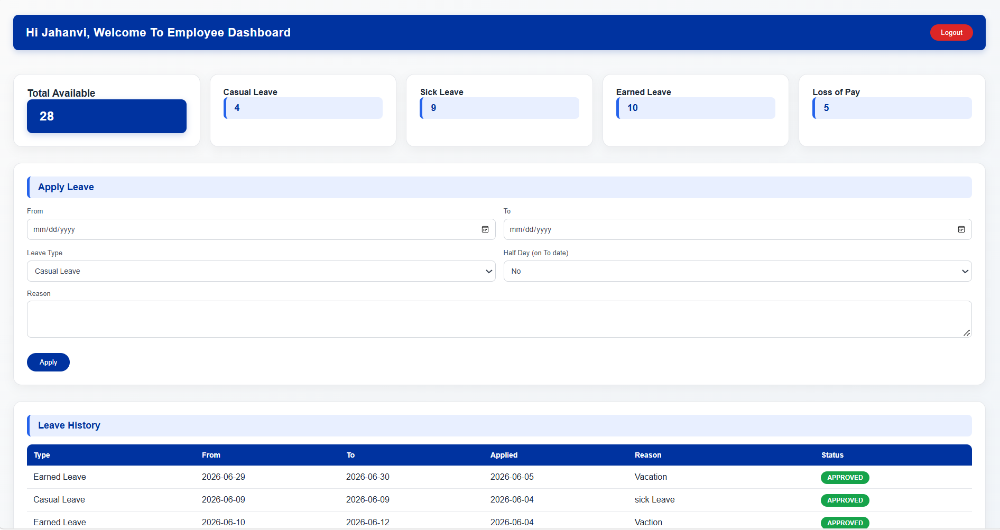
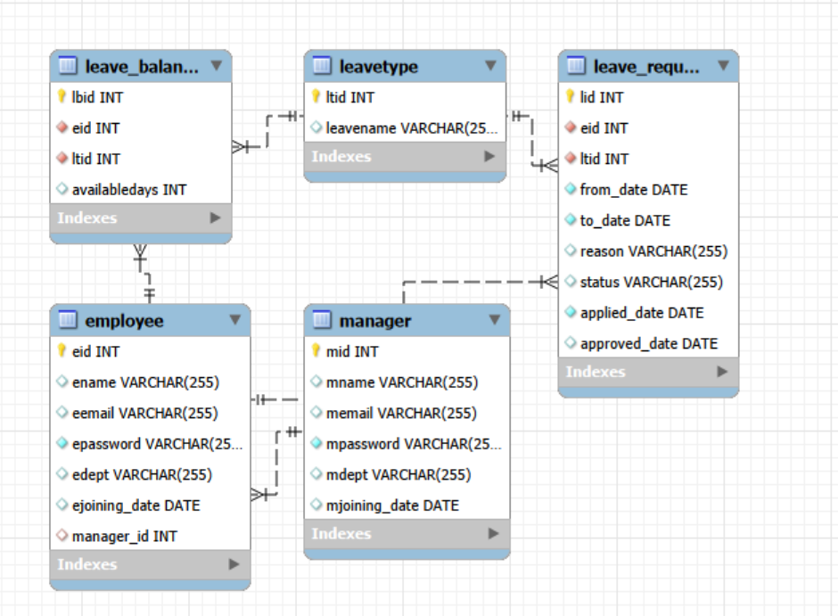

# 🏢 Leave Management System

A web-based **Leave Management System (LMS)** developed using **Spring Boot, MySQL, HTML, CSS, and JavaScript**.

The system allows employees to apply for different types of leaves, view their available leave balance and leave history, while managers can review and manage employee leave requests.

---

## 📌 Project Overview

The Leave Management System is designed to simplify the process of applying for, approving, rejecting, and tracking employee leaves.

It provides separate dashboards for:

- 👨‍💼 Managers
- 👨‍💻 Employees

The application maintains employee information, manager information, leave types, leave balances, and leave requests in a MySQL database.

---

## 🚀 Features

### 👨‍💻 Employee

- Employee login
- View available leave balance
- Apply for leave
- Select leave type
- Select leave start and end dates
- Enter leave reason
- Apply for half-day leave
- View leave application history
- Check leave request status
- View approved and rejected requests
- Logout

### 👨‍💼 Manager

- Manager login
- View employee leave requests
- View pending and previous leave requests
- Approve leave requests
- Reject leave requests
- View employee leave information
- Track leave request status
- Logout

---

## 🛠️ Technologies Used

| Technology | Purpose |
|---|---|
| **Java** | Backend programming |
| **Spring Boot** | Backend framework |
| **Spring MVC** | Web application architecture |
| **MySQL** | Database |
| **HTML5** | Web page structure |
| **CSS3** | Styling and responsive UI |
| **JavaScript** | Client-side functionality |
| **Maven** | Project and dependency management |
| **Git & GitHub** | Version control |

---

## 🏗️ System Architecture

```text
             ┌──────────────────────┐
             │       Browser        │
             │  HTML/CSS/JavaScript │
             └──────────┬───────────┘
                        │
                        ▼
             ┌──────────────────────┐
             │     Spring Boot      │
             │      Backend         │
             │                      │
             │ Controllers          │
             │ Services             │
             │ Repositories         │
             └──────────┬───────────┘
                        │
                        ▼
             ┌──────────────────────┐
             │        MySQL         │
             │       Database       │
             └──────────────────────┘
```

---

## 🗄️ Database Design

The application uses MySQL for storing employee, manager, leave type, leave balance, and leave request information.

### Main Tables

```text
Manager
   │
   │ 1 : N
   ▼
Employee
   │
   ├───────────────┐
   │               │
   ▼               ▼
Leave Balance   Leave Request
   │               │
   ▼               ▼
Leave Type      Leave Type
```

### Tables

#### 1. `manager`

Stores manager information.

| Column | Description |
|---|---|
| `mid` | Manager ID |
| `mname` | Manager name |
| `memail` | Manager email |
| `mpassword` | Manager password |
| `mdept` | Department |
| `mjoining_date` | Joining date |

#### 2. `employee`

Stores employee information.

| Column | Description |
|---|---|
| `eid` | Employee ID |
| `ename` | Employee name |
| `eemail` | Employee email |
| `epassword` | Employee password |
| `edept` | Department |
| `ejoining_date` | Joining date |
| `manager_id` | Assigned manager |

#### 3. `leavetype`

Stores available leave types.

Examples:

- Casual Leave
- Sick Leave
- Earned Leave
- Loss of Pay

#### 4. `leave_balance`

Stores the available leave balance of each employee for each leave type.

| Column | Description |
|---|---|
| `lbid` | Leave balance ID |
| `eid` | Employee ID |
| `ltid` | Leave type ID |
| `availabledays` | Available leave days |

#### 5. `leave_request`

Stores employee leave applications.

| Column | Description |
|---|---|
| `lid` | Leave request ID |
| `eid` | Employee ID |
| `ltid` | Leave type ID |
| `from_date` | Leave starting date |
| `to_date` | Leave ending date |
| `reason` | Reason for leave |
| `status` | Pending / Approved / Rejected |
| `applied_date` | Date of application |
| `approved_date` | Date of approval/rejection |

---

## 🔐 User Roles

### Employee

```text
Login
  ↓
Employee Dashboard
  ↓
View Leave Balance
  ↓
Apply Leave
  ↓
Manager Review
  ↓
Approved / Rejected
  ↓
Leave History
```

### Manager

```text
Login
  ↓
Manager Dashboard
  ↓
View Leave Requests
  ↓
Review Request
  ↓
Approve / Reject
  ↓
Request Status Updated
```

---

## 🖥️ Application Screenshots

### 🔐 Login Page



---

### 👨‍💼 Manager Dashboard

The manager dashboard displays pending and previous employee leave requests along with their status.



---

### 👨‍💻 Employee Dashboard

The employee dashboard displays available leave balances, leave application form, and leave history.



---

### 🗄️ Database / ER Diagram

The database contains relationships between managers, employees, leave types, leave balances, and leave requests.



---

## ⚙️ How to Run the Project

### 1. Clone the Repository

```bash
git clone https://github.com/Srinivas-katreddi/LMSApplication.git
```

### 2. Open the Project

Open the project in:

- IntelliJ IDEA
- Eclipse
- Spring Tool Suite
- VS Code

---

### 3. Configure MySQL

Create the database:

```sql
CREATE DATABASE lms;
USE lms;
```

Create the required tables using the SQL scripts provided in the project.

---

### 4. Configure Database Connection

Update your Spring Boot database configuration with your MySQL username, password, and database name.

Example:

```properties
spring.datasource.url=jdbc:mysql://localhost:3306/lms
spring.datasource.username=root
spring.datasource.password=YOUR_PASSWORD

spring.jpa.hibernate.ddl-auto=update
spring.jpa.show-sql=true
```

> Replace `YOUR_PASSWORD` with your local MySQL password.

---

### 5. Build the Project

Using Maven:

```bash
mvn clean install
```

---

### 6. Run the Application

```bash
mvn spring-boot:run
```

Or run the main Spring Boot application class directly from your IDE.

---

## 📊 Leave Types

The system currently supports:

- 🟢 Casual Leave
- 🟢 Sick Leave
- 🟢 Earned Leave
- 🔴 Loss of Pay

---

## 🔄 Leave Request Workflow

```text
Employee
   │
   │ Apply Leave
   ▼
Leave Request
   │
   │ Status = PENDING
   ▼
Manager
   │
   ├───────────────┐
   │               │
Approve          Reject
   │               │
   ▼               ▼
APPROVED        REJECTED
```

---

## 🎯 Project Objectives

- Automate the employee leave application process.
- Reduce manual leave management.
- Provide employees with real-time leave balance information.
- Allow managers to efficiently review leave requests.
- Maintain centralized leave records.
- Track approved and rejected leave applications.
- Improve transparency between employees and managers.

---

## 🔮 Future Enhancements

Some possible future improvements include:

- 📧 Email notifications for leave status changes
- 📱 Mobile-responsive improvements
- 🔐 Spring Security authentication and authorization
- 🔑 Password encryption
- 📊 Leave analytics and reports
- 📅 Calendar-based leave visualization
- 👥 Admin dashboard
- 🔔 Real-time notifications
- 📄 Export leave reports to PDF/Excel

---

## 👥 Project Team

This project was developed as part of the **Cognizant training program** while working as **Programmer Analyst Trainees (PATs)**.

### Team Members

| Name | Role |
|---|---|
| **K. Sai Srinivas** | Programmer Analyst Trainee |
| **K. Girish** | Programmer Analyst Trainee |
| **M. Balaji** | Programmer Analyst Trainee |
| **A. Jahnavi** | Programmer Analyst Trainee |

The project was developed collaboratively as part of our hands-on training, using **Spring Boot, MySQL, HTML, CSS, and JavaScript** to build a Leave Management System.

**Organization:** Cognizant  
**Program:** Programmer Analyst Trainee Training  
**Project Type:** Team Training Project
